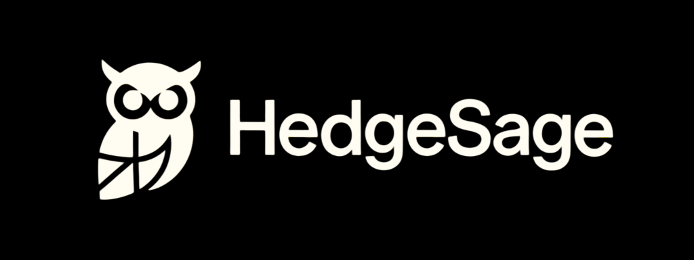

# [HedgeSage](https://denk1k.github.io/hedgesage/)
A free and open-source hedge fund position aggregator and investment simulator
## ✨ It uses 13F filings to:
* Aggregate current hedge fund positions
* Backtest the funds' original performance
* Simulate returns that would have been achieved by copying the hedge funds' positions
  * With manager-weighted allocation
  * With manager-weighted allocation and investment value scaled to 100% of the portfolio
* And shows all of this within a simple, neat and minimal UI :)

## 🚀 Running yourself is very simple:
* Clone the repo. 
* Install the dependencies using `pip install -r requirements.txt`.
* To update live allocations, run `python runner_update_allocations.py`
* To run the backtests, run `python runner_do_backtests.py`
* To run the UI live, run `cd src_site && npm run dev`
* To build the UI in the `docs` directory, run `cd src_site && npm run build`

## 📊 How it works:
* Data for hedge fund live allocations is refreshed daily using a Github Action powered by `runner_update_allocations.py`, which fetches the hedge funds from the `top_funds.json` file and runs the refresh function from `fetch_hedge_fund_allocations.py`. The live allocations are saved to `./sec/allocations`, whilst CUSIP conversion cache is saved to `./sec/cusip_conversion_table.json`.
* The backtesting entrypoint is `runner_do_backtests.py`, whilst the backtesting and downloading functionality is implemented in `backtester.py` and `download_data.py`, respectively. The backtests are saved to `./sec/backtests`, historical allocations are saved to `./sec/past_allocations`, whereas price history is saved to `./data/historical`.
* The HedgeSage UI is built using [Svelte](https://svelte.dev/), with [shadcn-svelte](https://shadcn-svelte.com/) used as the component library. It acts merely as a front-end to the information stored in this repository. The builds are targeting the `docs` directory for simplicity in use with GitHub Pages.

## TODO:
-   [ ] Implement fund searching functionality
-   [x] Allow to retrieve 13F data from .txt files, letting backtests through years earlier than 2013.
-   [ ] Allow for inclusion and downloading of non-stock tickers for the backtests
-   [ ] Adjust extreme volatility data sanite checks.
-   [ ] Portfolio builder with CSV allocation export
-   [x] Fix the live allocations retriever (basically copy functionality from the past allocations retriever)
-   [x] Prevent rate limits from sec.gov
-   [ ] There is an inefficiency in `runner_do_backtests.py`, as the allocations fetching is done twice.
-   [ ] Make backtests runnable on GitHub Actions